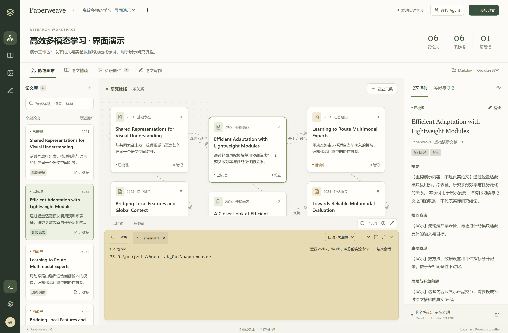

# Paperweave

**读论文、理脉络、记笔记、画图、写论文，一个工作台。**

你继续和 Codex / Claude Code 讨论，Agent 读到的论文、建立的关系和整理的笔记会实时出现在面板里。笔记可以直接接入 Obsidian。

## 开始使用

把下面这段话发给你的 Agent：

> 帮我安装并启动 https://github.com/shanyuzhe/paperweave 。请先读仓库的 INSTALL.md，检测并安装缺失的依赖，连接我正在使用的 CLI，并完成验证。笔记先使用默认目录；如果我提供了 Obsidian vault，就连接那个目录。完成后告诉我打开哪里。

然后打开 Agent 给你的地址，直接在页面内和 Agent 对话，就可以开始了。

下次说“启动 Paperweave”即可；也可以在项目目录运行 `npm start`，它会启动服务并打开页面。

## 日常怎么用

| 想做什么 | 你可以这样说 |
| --- | --- |
| 梳理一个新领域 | “用 Paperweave 梳理这个方向，补充论文摘要，画出发展脉络。” |
| 精读一篇论文 | “读这篇论文，把方法、发现和局限整理进看板。” |
| 弄懂一个问题 | 在页面划选原文、写下问题，再对 Agent 说：“看看当前问题，给我讲明白。” |
| 留下自己的理解 | “把刚才讨论清楚的内容记成笔记，关联到这篇论文。” |
| 科研绘图 | “把这个方法画成模型图，导出可编辑 PPT；用这些真实结果数据画图。” |
| 写论文 | “根据已经核实的论文和笔记，组织提纲，和我一起修改草稿。” |

研究资料保存在你的电脑上。每个领域可以使用独立的研究空间。终端支持拖动调高、分屏和切换配色；能读取到本地 Windows Terminal 配色时会自动沿用，否则使用奶油黄。

想多了解一点：[简短使用指南](docs/USER_GUIDE.md)。

## 给 Agent 和开发者

[安装入口](INSTALL.md) · [Agent 操作手册](docs/AGENT_GUIDE.md) · [跨平台依赖修复](docs/DEPENDENCIES.md) · [统一研究规范](docs/WORKFLOW.md) · [MCP 接口](docs/MCP.md) · [技术参考与当前边界](docs/REFERENCE.md) · [验证记录](docs/VALIDATION.md)

当前是可运行的本地 MVP，支持 Codex、Claude Code 及标准 MCP 客户端。MIT License.
